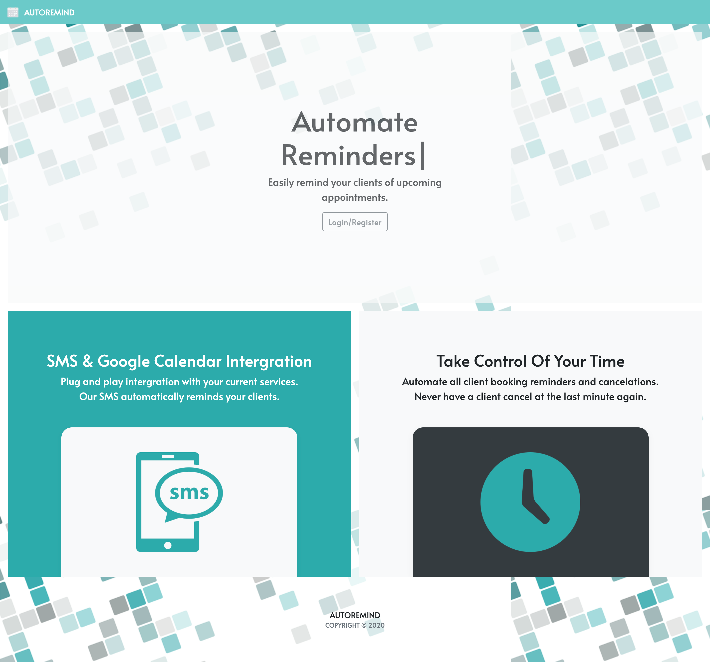
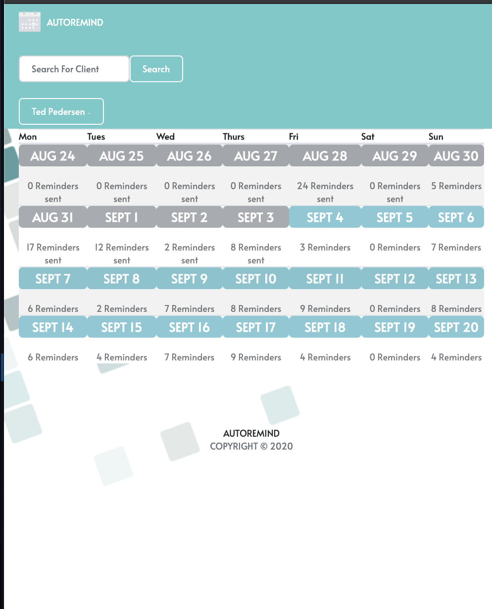

# Automate Reminders
An application to remind clients of their scheduled appointment times. Reminders will be sent out 24-hours prior via SMS with an option to reschedule and cancel. 

## Built With:
* HTML
* CSS
* Node 
* Bootstrap 
* Handlebars
* Twillo 
* Google Calendar

## Screenshots:
* ### Automate Reminders Homepage

* ### Automate Reminders Layout

## Links:
* Heroku: https://autoremind.herokuapp.com/
* Github: https://tedpedersen.github.io/autoremind/

## Built by:
Ted Pedersen, Mukul Sharma, Osborn Roxas, and Jessica Lam